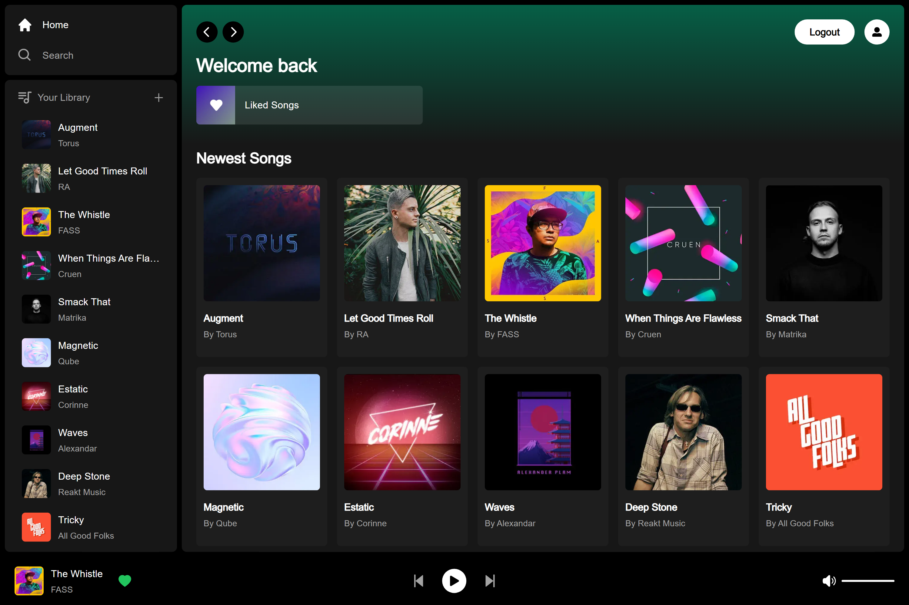

# <p align="center" id="top">TUNIFY</p>



For DEMO, use [Stripe Testing Cards](https://stripe.com/docs/testing)

Tech stack: Next.js, React, Tailwind, Supabase, PostgreSQL, Stripe

Key Features:

- Song upload
- Stripe integration
- Tailwind design for sleek UI
- Tailwind animations and transition effects
- Full responsiveness for all devices
- Credential authentication with Supabase
- Github authentication integration
- File and image upload using Supabase storage
- Client form validation and handling using react-hook-form
- Server error handling with react-toast
- Play song audio
- Favorites system
- Playlists / Liked songs system
- Advanced Player component
- Stripe recurring payment integration
- Cancelling Stripe subscriptions

### Prerequisites

**Node version 14.x**

### Cloning the repository

```shell
git clone https://github.com/arjunan-k/Tunify
```

### Install packages

```shell
npm i
```

### Setup .env file

```js
NEXT_PUBLIC_SUPABASE_URL=
NEXT_PUBLIC_SUPABASE_ANON_KEY=
SUPABASE_SERVICE_ROLE_KEY=

NEXT_PUBLIC_STRIPE_PUBLISHABLE_KEY=
STRIPE_SECRET_KEY=
STRIPE_WEBHOOK_SECRET=
```

### Add SQL Tables

Use `database.sql` file, create songs and liked_songs table (there is a video tutorial)

### Start the app

```shell
npm run dev
```

## Available commands

Running commands with npm `npm run [command]`

| command         | description                                   |
| :-------------- | :-------------------------------------------- |
| `dev`           | Starts a development instance of the app      |
| `build`         | Build app which is optimized for production   |

<a href="#top">Back to top</a>